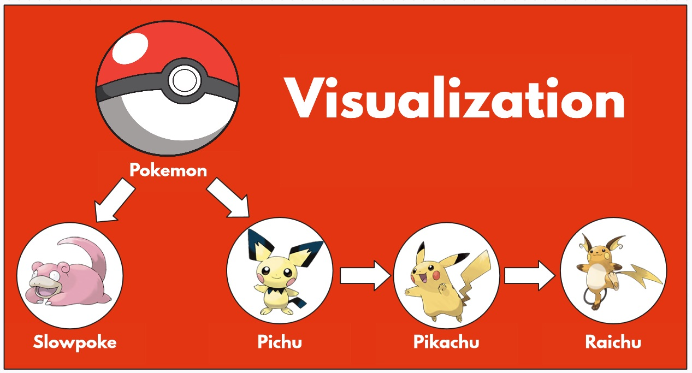
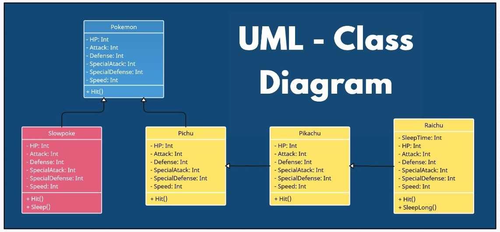
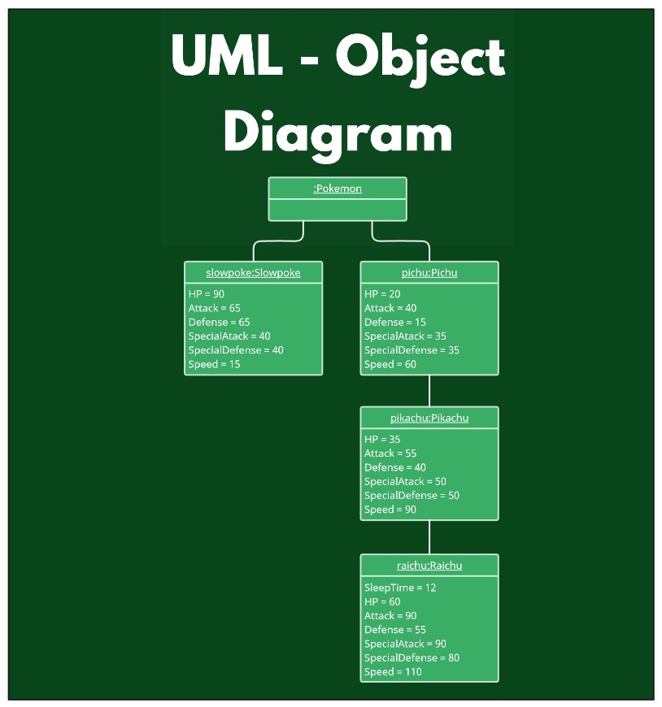
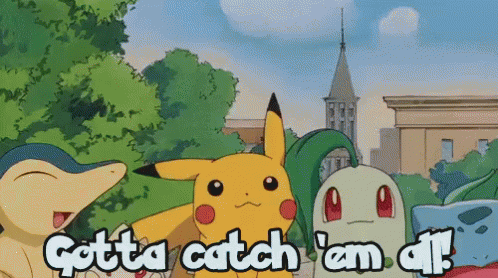

<div id="header" align="center">
  
</div>

<div id="diagrams">
<h2 align="center">📊 D I A G R A M S 📊</h2>
 
<b>Визуализация</b> – демонстрация того, что из себя представляет наша система на основе реальных примеров.
<br>

<hr/>


<b>UML - диаграмма классов</b> показывает классы в системе, атрибуты и операции каждого класса, а также отношения между каждым классом.
<br>

<hr/>


<b>UML - диаграмма объектов</b> показывает отношения между объектами и то, как будет выглядеть система в определенный момент времени. Поскольку в объектах имеются данные, они используются для объяснения сложных отношений между объектами.
<br>
<p align="center">
  
</p>
</div>

<div id="implementation">
<h2 align="center">👁️‍🗨️ I M P L E M E N T A T I O N 👁️‍🗨️</h2>

<h3>&nbsp;&nbsp;&nbsp;&nbsp;&nbsp;&nbsp;&nbsp;&nbsp;&nbsp;&nbsp;&nbsp;&nbsp; Pokemon</h3>


```csharp
public abstract class Pokemon
{
     public int HP { get; protected set; } 
     public int Attack { get; protected set; } 
     public int Defense { get; protected set; } 
     public int SpecialAtack { get; protected set; } 
     public int SpecialDefense { get; protected set; } 
     public int Speed { get; protected set; } 
     
     public abstract void Hit();
}
```
<hr/>

<h3>&nbsp;&nbsp;&nbsp;&nbsp;&nbsp;&nbsp;&nbsp;&nbsp;&nbsp;&nbsp;&nbsp;&nbsp; Slowpoke</h3>

  
```csharp
public class Slowpoke : Pokemon
{
    public Slowpoke()
    { 
        HP = 90;
        Attack = 65;
        Defense = 65;
        SpecialAtack = 40;
        SpecialDefense = 40;
        Speed = 15;   
    }
    
    sealed public override void Hit() => Console.WriteLine ("+Did nothing+");
    
    public void Sleep() => Console.WriteLine ("+Sleep+");
}
```
<hr/>

<h3>&nbsp;&nbsp;&nbsp;&nbsp;&nbsp;&nbsp;&nbsp;&nbsp;&nbsp;&nbsp;&nbsp;&nbsp; Pichu</h3>

  
```csharp
public class Pichu : Pokemon
{
    public Pichu()
    { 
        HP = 20;
        Attack = 40;
        Defense = 15;
        SpecialAtack = 35;
        SpecialDefense = 35;
        Speed = 60;   
    }
    
    public override void Hit() => Console.WriteLine ("Use +Weak lightning+");
}
```
<hr/>

<h3>&nbsp;&nbsp;&nbsp;&nbsp;&nbsp;&nbsp;&nbsp;&nbsp;&nbsp;&nbsp;&nbsp;&nbsp; Pikachu</h3>


```csharp
public class Pikachu : Pichu
{
    public Pikachu()
    {
        HP += 15;    
        Attack += 15;
        Defense += 25;
        SpecialAtack += 15;
        SpecialDefense += 15;
        Speed += 30;
    }
    
    public override void Hit()
    {
        base.Hit();
        Console.WriteLine (" than use +Flash+");
    }
}
```
<hr/>

<h3>&nbsp;&nbsp;&nbsp;&nbsp;&nbsp;&nbsp;&nbsp;&nbsp;&nbsp;&nbsp;&nbsp;&nbsp; Raichu</h3>

 
```csharp
public class Raichu : Pikachu
{
    private const int SleepTime = 12;
    
    public Raichu()
    {
        HP += 25;
        Attack += 35;
        Defense += 15;
        SpecialAtack += 40;
        SpecialDefense += 30;
        Speed += 20;
    }
    
    sealed public override void Hit() => Console.WriteLine ("Use +Strong lightning+");
        
    public void SleepLong() => Console.WriteLine ($"+Sleep {SleepTime} hours+");   
}
```
</div>

<div id="literature">
<h2 align="center">📚 L I T E R A T U R E 📚</h2>

📗 [<i>Характеристики покемонов</i>](https://pokemondb.net/)
<br>
📘 [<i>Картинки покемонов</i>](https://www.pokemon.com/ru/)
<br>
📕 [<i>Взаимосвязи схемы классов UML, объясненные с примерами</i>](https://creately.com/blog/ru/uncategorized-ru/%D0%B2%D0%B7%D0%B0%D0%B8%D0%BC%D0%BE%D1%81%D0%B2%D1%8F%D0%B7%D0%B8-%D1%81%D1%85%D0%B5%D0%BC%D1%8B-%D0%BA%D0%BB%D0%B0%D1%81%D1%81%D0%BE%D0%B2-uml-%D0%BE%D0%B1%D1%8A%D1%8F%D1%81%D0%BD%D0%B5%D0%BD%D0%BD/)
</div>

<hr/>
<p align="center">
  
</p>
